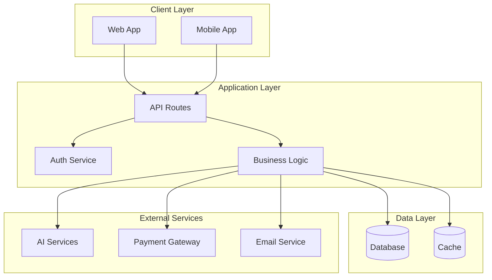
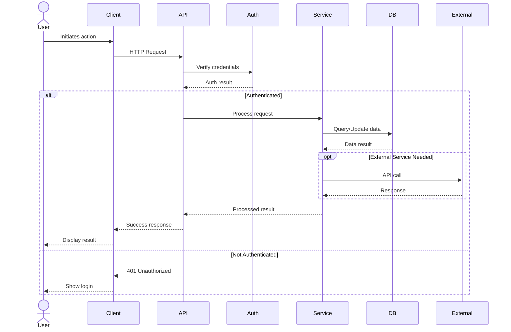
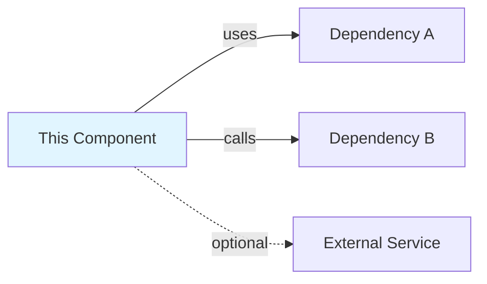

# Codebase Architecture Scanner

This skill helps you automatically scan your codebase and generate comprehensive architectural documentation at multiple levels of detail.

## When to Use

Use this skill when you need to:

- **Generate initial architecture documentation** for a new or undocumented project
- **Update existing architecture docs** after major refactors or feature additions
- **Onboard new developers** with comprehensive architecture overviews
- **Conduct architecture reviews** or audits
- **Create C4 diagrams** or similar architectural views
- **Document cross-cutting concerns** (auth, data flow, integrations)
- **Prepare for stakeholder presentations** requiring architecture explanations

## Documentation Levels

This skill generates documentation at three levels:

### 1. High-Level Overview (Executive/Stakeholder View)
- System context and boundaries
- Major components and their responsibilities
- Key technologies and frameworks
- Integration points and external dependencies
- Data flow at a macro level

### 2. Component-Level Documentation (Developer View)
- Detailed component architecture
- Module organization and responsibilities
- API contracts and interfaces
- Database schemas and models
- State management patterns
- Security and authentication flows

### 3. Implementation Details (Maintainer View)
- Code organization conventions
- Critical patterns and utilities
- Configuration and environment setup
- Testing strategies
- Deployment architecture
- Performance considerations

## Instructions

### Phase 1: Discovery and Analysis

1. **Identify Project Type and Stack**
   - Read `package.json`, build configs, and framework files
   - Detect: Next.js/React, backend framework, database, cloud services
   - Note monorepo structure if present

2. **Scan Directory Structure**
   - Use `Glob` to map out key directories (`src/`, `app/`, `pages/`, `components/`, etc.)
   - Identify organizational patterns (feature-based, layer-based, domain-driven)
   - Note special directories (`api/`, `lib/`, `utils/`, `services/`, etc.)

3. **Analyze Key Files**
   - **API Routes**: Scan `pages/api/`, `app/api/`, or framework-specific route files
   - **Database**: Find schema files, migration directories, ORM configs
   - **Components**: Identify component library structure
   - **Services**: Locate business logic, external integrations
   - **Configuration**: Environment files, build configs, middleware

4. **Map Dependencies and Integrations**
   - External APIs (payment, auth, AI, etc.)
   - Database connections
   - Cloud services (hosting, storage, CDN)
   - Third-party libraries and frameworks

5. **Identify Cross-Cutting Concerns**
   - Authentication and authorization patterns
   - Error handling strategies
   - Logging and monitoring
   - Caching strategies
   - Rate limiting
   - Security measures (input validation, sanitization, CSP)

### Phase 2: Documentation Generation

6. **Generate High-Level Overview**
   Create a document with:
   - **System Context Diagram** (text-based or C4 format)
   - **Component Overview** (5-10 major components)
   - **Technology Stack Summary**
   - **Key Integration Points**
   - **Data Flow Summary**
   - **Deployment Architecture**

7. **Generate Component-Level Documentation**
   For each major component/module:
   - **Purpose and Responsibilities**
   - **Key Files and Structure**
   - **Public API/Interfaces**
   - **Dependencies** (internal and external)
   - **Data Models** (if applicable)
   - **Configuration Options**
   - **Security Considerations**

8. **Generate Implementation Details**
   - **Code Organization Conventions**
   - **Critical Patterns** (with file references)
   - **Utility Functions and Helpers**
   - **Testing Strategy**
   - **Build and Deployment Process**
   - **Environment Configuration**
   - **Performance Optimizations**

9. **Create Visual Diagrams with Mermaid**
   Generate Mermaid diagrams embedded in markdown for:

   **System Architecture Diagrams**:
   - **C4 Context Diagram** (Level 1) - System and external dependencies
   - **C4 Container Diagram** (Level 2) - High-level technical building blocks
   - **Component Diagram** (Level 3) - Internal structure of containers

   **Flow Diagrams**:
   - **Data Flow Diagrams** - How data moves through the system
   - **Sequence Diagrams** - Critical user flows and API interactions
   - **State Diagrams** - Authentication flows, lifecycle states

   **Data Architecture**:
   - **Entity Relationship Diagrams** - Database schema visualization
   - **Class Diagrams** - Object models and relationships

   **Mermaid Syntax Examples**:

   **Flowchart (System Architecture)**:
   ```mermaid
   flowchart TB
       User[User] --> NextJS[Next.js App]
       NextJS --> API[API Routes]
       API --> Auth[Auth Service]
       API --> DB[(Database)]
       API --> AI[AI Service]
       AI --> OpenAI[OpenAI API]
       AI --> Claude[Claude API]
   ```

   **C4 Context Diagram**:
   ```mermaid
   C4Context
       title System Context for <Your System>

       Person(user, "End User", "Uses the product")
       System(app, "Your System", "The application being documented")
       System_Ext(idp, "Identity Provider", "OAuth / SSO")
       System_Ext(db, "Managed Database", "Primary datastore")
       System_Ext(mail, "Email Service", "Transactional email")

       Rel(user, app, "Uses", "HTTPS")
       Rel(app, idp, "Authenticates via", "OIDC")
       Rel(app, db, "Reads and writes", "TCP")
       Rel(app, mail, "Sends notifications", "API")
   ```

   **Sequence Diagram (User Flow)**:
   ```mermaid
   sequenceDiagram
       actor User
       participant App
       participant API
       participant Auth
       participant AI

       User->>App: Click "Generate NPC"
       App->>API: POST /api/generate-npc
       API->>Auth: Verify token
       Auth-->>API: Token valid
       API->>AI: Generate NPC
       AI-->>API: NPC data
       API->>App: Return NPC
       App->>User: Display NPC
   ```

   **Entity Relationship Diagram**:
   ```mermaid
   erDiagram
       USER ||--o{ NPC : creates
       USER {
           uuid id PK
           string email
           string tier
       }
       NPC {
           uuid id PK
           uuid user_id FK
           string name
           json stats
           timestamp created_at
       }
       NPC ||--o{ PLOT_HOOK : has
       PLOT_HOOK {
           uuid id PK
           uuid npc_id FK
           text content
       }
   ```

   **State Diagram (Auth Flow)**:
   ```mermaid
   stateDiagram-v2
       [*] --> Unauthenticated
       Unauthenticated --> Authenticating: Login
       Authenticating --> Authenticated: Success
       Authenticating --> Unauthenticated: Failure
       Authenticated --> Unauthenticated: Logout
       Authenticated --> [*]
   ```

   **Class Diagram (Service Layer)**:
   ```mermaid
   classDiagram
       class NPCGenerator {
           +generateNPC(params)
           +validateInput(input)
           -callAI(prompt)
       }
       class GuardrailService {
           +checkSRDCompliance(content)
           +sanitizeInput(text)
       }
       class AIService {
           +callOpenAI(prompt)
           +callClaude(prompt)
       }

       NPCGenerator --> GuardrailService
       NPCGenerator --> AIService
   ```

   **How to Embed Mermaid in Markdown**:
   - Use triple backtick code blocks with `mermaid` language identifier
   - GitHub, GitLab, and most markdown renderers support Mermaid natively
   - Diagrams render automatically in pull requests and documentation
   - Version-controllable (text-based, no binary image files)

### Phase 3: Output and Validation

10. **Organize Documentation**
    - Create `docs/architecture/` directory if not exists
    - Generate files:
      - `overview.md` - High-level architecture
      - `components.md` - Component details
      - `implementation.md` - Implementation guide
      - `data-flow.md` - Data flow documentation
      - `integrations.md` - External integrations
      - `security.md` - Security architecture
      - `diagrams/` - Visual diagrams (if generated)

11. **Cross-Reference Existing Documentation**
    - Check for existing ADRs, design docs, API docs
    - Link to relevant existing documentation
    - Flag any conflicts or outdated information

12. **Generate Table of Contents**
    - Create master index of all architecture docs
    - Add navigation links between related docs

## Output Format

### File: `docs/architecture/overview.md`
```markdown
# Architecture Overview

## System Context

[Brief description of the system and its purpose]

## Technology Stack

- **Frontend**: [Framework and key libraries]
- **Backend**: [Framework and key services]
- **Database**: [Database technology]
- **Infrastructure**: [Hosting, CDN, etc.]
- **External Services**: [Third-party integrations]

## High-Level Architecture



## Key Components

1. **Component Name**
   - Purpose: [What it does]
   - Technologies: [Key tech used]
   - Integration Points: [What it connects to]

## Data Flow

### User Request Flow



## Security Architecture

- **Authentication**: [Auth mechanism used]
- **Authorization**: [Permission model]
- **Input Validation**: [Validation strategy]
- **Data Encryption**: [Encryption at rest/transit]
- **API Security**: [Rate limiting, CORS, etc.]

## Deployment Architecture

```mermaid
flowchart LR
    subgraph "CDN"
        CDN[Static Assets]
    end

    subgraph "App Server"
        Server[Next.js Server]
    end

    subgraph "Database"
        Primary[(Primary DB)]
        Replica[(Read Replica)]
    end

    subgraph "External"
        AI[AI APIs]
        Storage[Object Storage]
    end

    CDN --> Server
    Server --> Primary
    Server --> Replica
    Server --> AI
    Server --> Storage
```

### File: `docs/architecture/components.md`
```markdown
# Component Architecture

## [Component 1 Name]

### Purpose
[What this component does and why it exists]

### Structure
```
[Directory structure]
```

### Key Files
- `path/to/file.ts` - [Description]
- `path/to/other.ts` - [Description]

### Public API
[List of exported functions, classes, components]

### Dependencies
- Internal: [List internal dependencies]
- External: [List external dependencies]

### Configuration
[Environment variables, config files]

### Security Considerations
[Auth, validation, sanitization relevant to this component]

### Component Interaction



---

[Repeat for each major component]
```

### File: `docs/architecture/implementation.md`
```markdown
# Implementation Guide

## Code Organization

[Explain the organizational patterns used]

## Critical Patterns

### Pattern Name
- **Location**: `path/to/pattern.ts`
- **Purpose**: [Why this pattern exists]
- **Usage**: [How to use it]
- **Example**:
  ```typescript
  [Code example]
  ```

## Conventions

- **Naming**: [Naming conventions]
- **File Structure**: [How files are organized]
- **Import Paths**: [Import conventions]

## Testing Strategy

[How to test different parts of the system]

## Build Process

[How the application is built]

## Environment Configuration

[How to configure the application]
```

## Tips for Best Results

1. **Start Broad, Then Go Deep**: Begin with the high-level overview, then drill into specific components
2. **Use Grep Strategically**: Search for patterns like `export`, `import`, `API`, `useAuth`, etc.
3. **Follow the Data**: Trace data flow from API endpoints → services → database
4. **Document the "Why"**: Include architectural decisions and trade-offs
5. **Keep It Updated**: Run this skill after major refactors or new features
6. **Link to Code**: Always include file paths and line references
7. **Validate Against Running System**: Cross-check documentation against actual behavior
8. **Use Mermaid Diagrams**: Embed Mermaid diagrams in markdown for version-controllable, auto-rendering visuals that display in GitHub/GitLab

## Advanced Options

When invoking this skill, you can specify:

- **`--focus=<component>`**: Focus on a specific component or subsystem
  - Examples: `--focus=auth`, `--focus=api`, `--focus=database`

- **`--level=<1|2|3>`**: Generate only specific documentation level
  - `--level=1`: High-level overview only (executives, stakeholders)
  - `--level=2`: Component-level details (developers)
  - `--level=3`: Implementation details (maintainers)

- **`--format=<markdown|c4|mermaid>`**: Specify diagram format (default: `mermaid`)
  - `markdown`: Text-based diagrams and descriptions
  - `c4`: C4 model diagrams (context, container, component)
  - `mermaid`: Mermaid diagrams embedded in markdown (recommended - renders on GitHub/GitLab)

- **`--update`**: Update existing documentation rather than regenerate
  - Preserves manual edits and ADRs
  - Only updates outdated sections

- **`--diagrams=<all|minimal|none>`**: Control diagram generation
  - `all`: Generate all diagram types (flowcharts, sequences, ERDs, etc.)
  - `minimal`: Only system context and high-level architecture
  - `none`: Text-based documentation only

## Example Invocations

```bash
# Generate component-level docs for auth subsystem with Mermaid diagrams
/codebase-architecture-scanner --focus=auth --level=2 --format=mermaid

# Generate full documentation with all diagram types
/codebase-architecture-scanner --diagrams=all

# Update existing docs without regenerating everything
/codebase-architecture-scanner --update

# High-level overview only for stakeholder presentation
/codebase-architecture-scanner --level=1 --diagrams=minimal
```

## Integration with Existing Documentation

This skill should:
- **Respect existing docs**: Don't overwrite ADRs or manually-crafted documentation
- **Cross-reference**: Link to existing API docs, testing guides, etc.
- **Flag inconsistencies**: Note where code and docs diverge
- **Suggest updates**: Recommend updates to outdated documentation

## Maintenance

After generating documentation:

1. **Review for Accuracy**: Validate technical details
2. **Add Context**: Enhance with business context and decisions
3. **Share for Feedback**: Get team input on clarity and completeness
4. **Keep Updated**: Regenerate sections as architecture evolves
5. **Version Control**: Commit documentation alongside code changes
