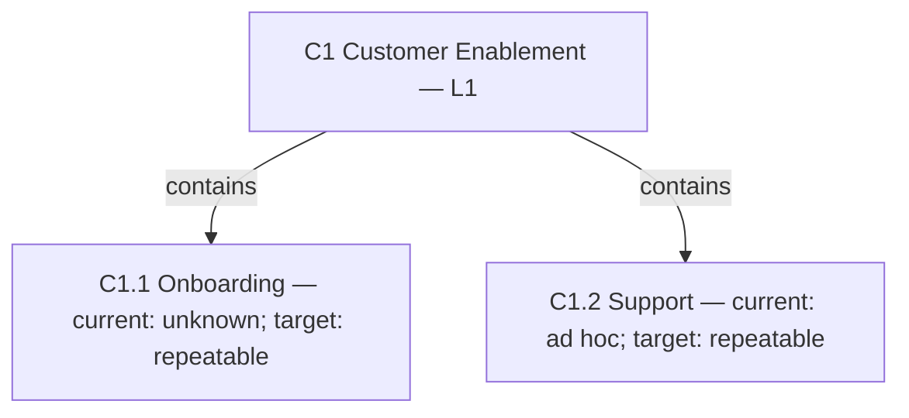
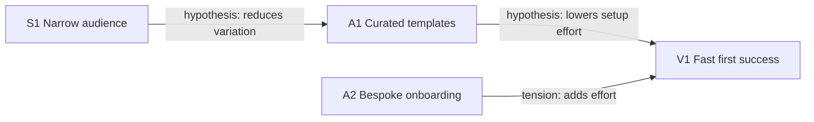
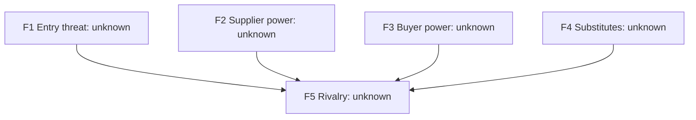
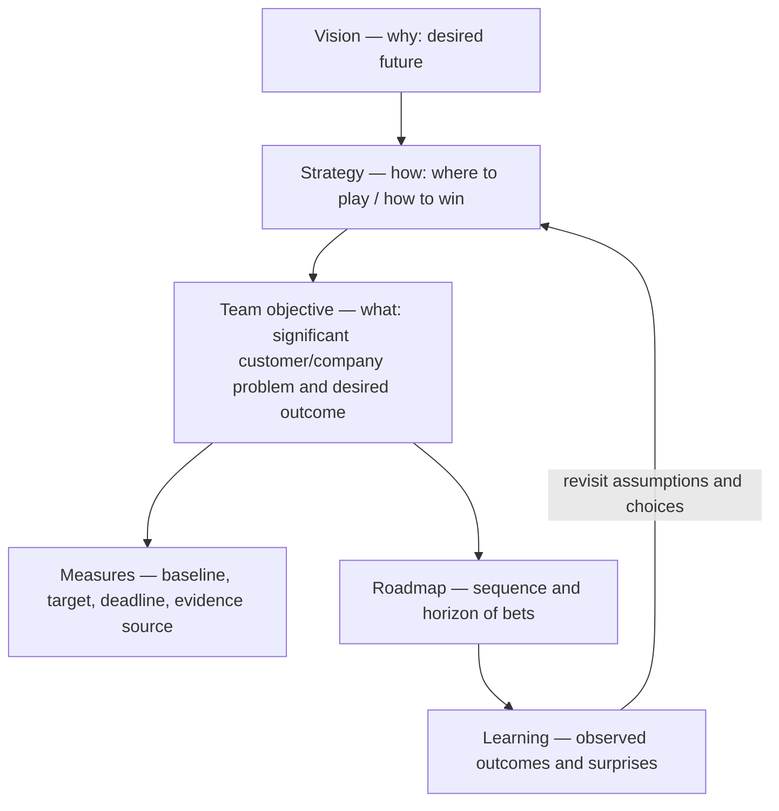

# Reusable diagram templates

Start with a table; replace all bracketed values. Use `unknown` for missing evidence. Keep the finished diagram and table consistent. The adjacent [gallery](../examples/diagram-gallery.html) provides offline HTML/SVG examples of all nine views.

## Shared record

`ID | statement/value | status (observed/inference/hypothesis/choice/proposed/unknown) | evidence/source/date | scope | decision implication`

Separate factual confidence from whether a choice has been accepted. Include diagram title, as-of date, legend, limitations, and one paragraph explaining the consequential finding.

## Product Strategy Canvas

Arrange five labeled cards for Roger Martin and A.G. Lafley's *Playing to Win* choice cascade: Winning Aspiration; Where to Play; How to Win; Capabilities; Management Systems. Add a sixth and seventh card (or a split card) for Key Measures and Open Assumptions. Reuse the substantive template from `pm-canvas/templates/product-strategy-canvas.md`. A CSS grid is sufficient; each card contains an ID, short statement, evidence status, and unresolved choice. Optional mission/aspiration context belongs above the canvas and must be identified as an addition.

Analysis: `[choice A] reinforces [choice B] through [mechanism]; [claim C] remains uncertain; choose/test [next step].`

## Value curve

Input: `factor ID | factor | relevance to segment | scale anchors | alternative current | product current | proposed target | source/date per observation`.

Use a declared scale only when a defensible rating method exists. Unknown is a missing value, never zero. Draw separate polyline segments on either side of a missing value; show a question mark or table entry. Draw targets dashed with square markers and explicit “proposed” labels; observed current values can be solid with circles. Keep axes and series labels visible in grayscale. Do not smooth categorical factors or imply statistical precision.

Analysis: identify the deliberate advantage, necessary baseline, sacrificed factor, unknown comparison, and research needed to substantiate it.

## Double Diamond discovery

Input: `phase | question | activity | evidence expected | decision | linked assumption IDs`.

Draw two adjacent diamonds using the Design Council's own four-stage labels (<https://www.designcouncil.org.uk/resources/the-double-diamond/>): Discover (diverge) and Define (converge) for the problem space; Develop (diverge) and Deliver (converge) for the solution space. Add outcome/problem and solution/test labels outside the shapes, with an iteration arrow back into Discover. Phase colors alone must not carry meaning. Do not label a concept validated merely because it reached Deliver.

Analysis: `[evidence] supports [problem]; compare [solutions]; test [assumption] using [criterion]; revisit [phase] if [signal].`

## Opportunity solution tree

Input: `node ID | layer (outcome/opportunity/solution/assumption_test) | parent ID | statement | evidence | status`.

Draw Teresa Torres's four-layer tree (*Continuous Discovery Habits*, 2021; <https://www.producttalk.org/opportunity-solution-trees/>): a single desired **outcome** at the root; the **opportunities** — customer needs, pain points, and desires — that could drive it as its children; candidate **solutions** nested under the opportunity each addresses; and **assumption tests** nested under each solution. Show an opportunity with no solution yet, and a solution with no test yet, as ordinary unfinished branches rather than pruning them for a tidier tree.

Analysis: `[opportunity] is evidenced by [source]; [solution] tests [assumption] via [test]; prioritize [node] because [criterion].`

## Capability hierarchy

Input: `ID | level/parent | name | definition/boundary | strategic role | current evidence/state | target | dependencies | gap`.

The displayed states above are illustrative. A capability relationship is containment, not a reporting line. Accompany maturity words with the rubric from `pm-capabilities` and evidence; do not mix strategic importance and maturity in a single score.

## Activity system / fit

Input: `from ID | to ID | type (reinforcing/conflicting/unknown) | mechanism | evidence | counterargument | test`.

Analysis must explain each important arrow. Use words such as “hypothesis” and “tension” on edges. The mere existence of a cycle is not proof of reinforcing fit or a moat.

## Outcome roadmap

| Now | Next | Later |
|---|---|---|
| O1 [outcome]; test A1; exit [evidence] | O2 [outcome]; depends on O1 finding | O3 [option]; revisit [trigger] |

Render as three lanes/cards, retaining IDs, state, and confidence. Add specific dates only when their status (commitment/estimate/proposal) is known. Explain why the dependencies or learning sequence justify these horizons.

## Five Forces

Draw an original diagram from the standard framework: rivalry at the center, with entry threat, supplier power, buyer power, and substitutes arranged around it. A channel/distribution label is context, not a sixth force.

Input: `industry boundary | force | evidence | mechanism | assessment/unknown | strategic response`.

Arrows show framework relationships, not measured causal effects. Include substitutes that solve the same job by a different means and specify which supplier/buyer groups are assessed.

## PESTEL

Render six cards labeled Political, Economic, Social, Technological, Environmental, Legal. Input: `ID | category | external signal | source/date | exposure mechanism | horizon | uncertainty | response`.

Analysis: prioritize only factors that change the choice. A generic list of possible concerns is not an assessment. Mark legal assertions unverified until checked against an applicable primary source.

## SWOT

| | Helpful | Harmful |
|---|---|---|
| Internal | S: [evidenced strength] | W: [evidenced weakness] |
| External | O: [external opportunity] | T: [external threat] |

Input: `ID | quadrant | claim | source/date | scope | uncertainty`.

Analysis: combine `[strength] + [opportunity]` into a candidate action, or `[weakness] + [threat]` into a risk/test. Preserve the internal/external distinction and do not confuse a brainstormed possibility with observed evidence.

## Strategic context and team objectives

Input: `vision/aspiration reference | strategic choices | problem evidence | objective ID | measures of success | roadmap bet IDs | review trigger`.

Explain how the team's objective serves the strategy and why solving the problem matters to customers and the company/project. An activity list is not an objective. Show unknown baselines rather than making up measures; distinguish proposed targets from commitments. The hierarchy supplies context, while the return loop shows that evidence can change higher-level choices.

## PESTLE workshop layout
Use [Lucid/Mermaid routing](lucid-mermaid.md) for the two-row PESTLE/PESTEL board layout, editable notes, and optional dot voting. This complements the analysis view above.

## Kano
Read [Kano guidance](../../pm-discovery/references/kano.md). Use Mermaid to represent categories and decision flow; an optional Lucid connector or local SVG suits curved axes better. For the classic Kano plot, show how fully a need is met horizontally and customer satisfaction vertically, and label the curves as conceptual, not measured survey output. Keep it separate from the questionnaire's category results. Pair any category plot with source/segment/date, category counts, mixed results and limitations. Never infer importance or plot an opportunity score from a category alone.

## Discovery, risk and handoff connections
For initial discovery (Double Diamond) versus continuous discovery (opportunity solution tree), read [discovery streams](../../pm-discovery/references/discovery-streams.md). Preserve context labels and feedback loops.
